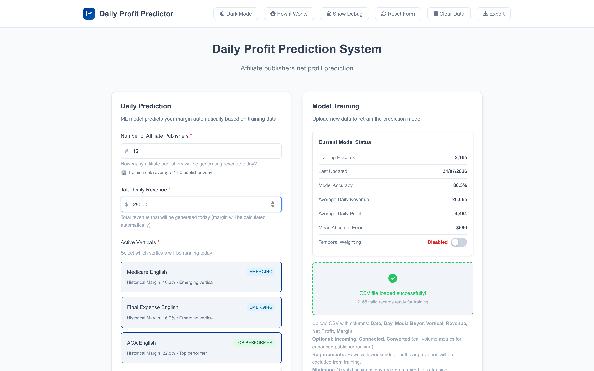
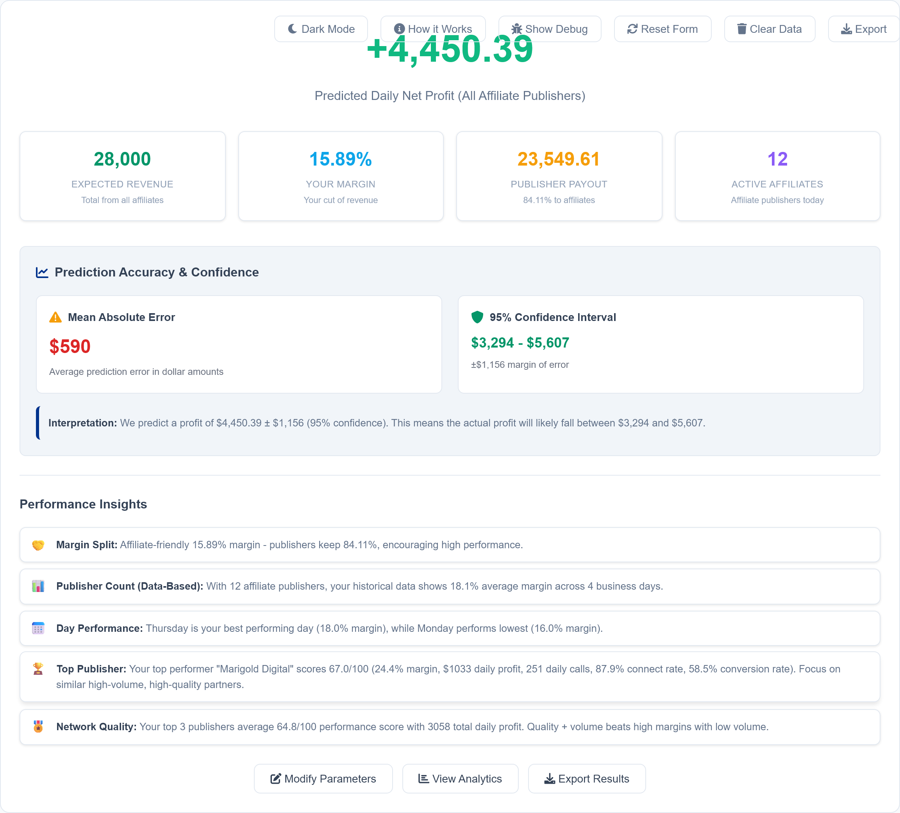
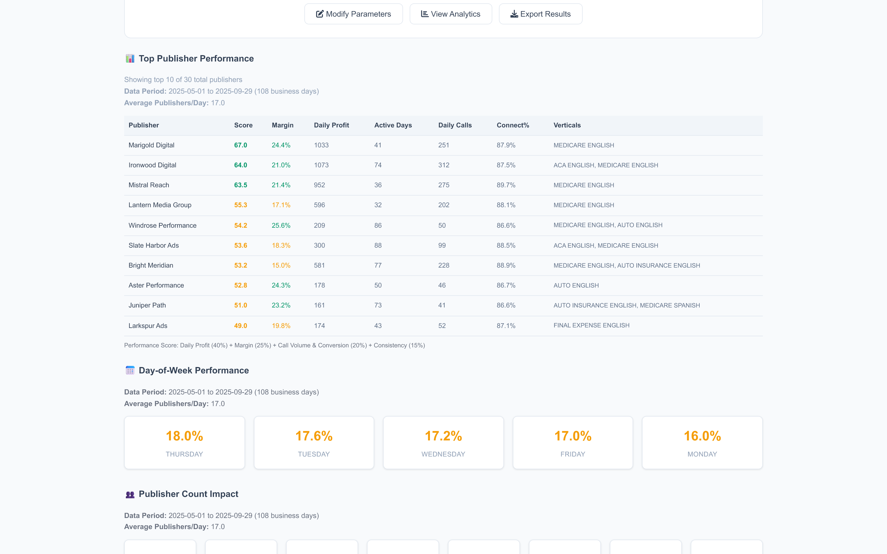
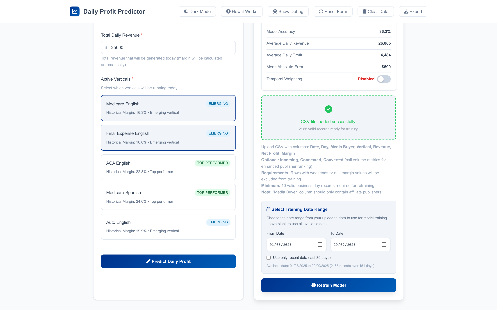
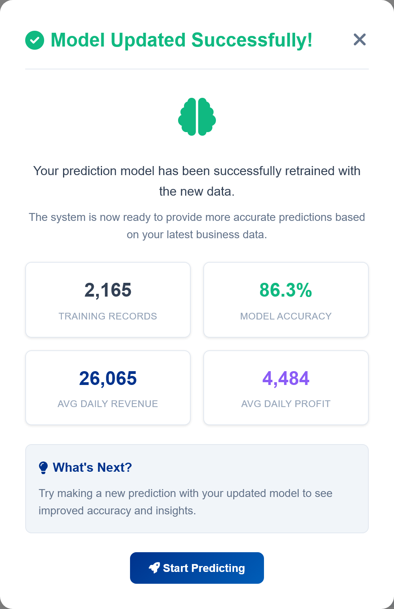
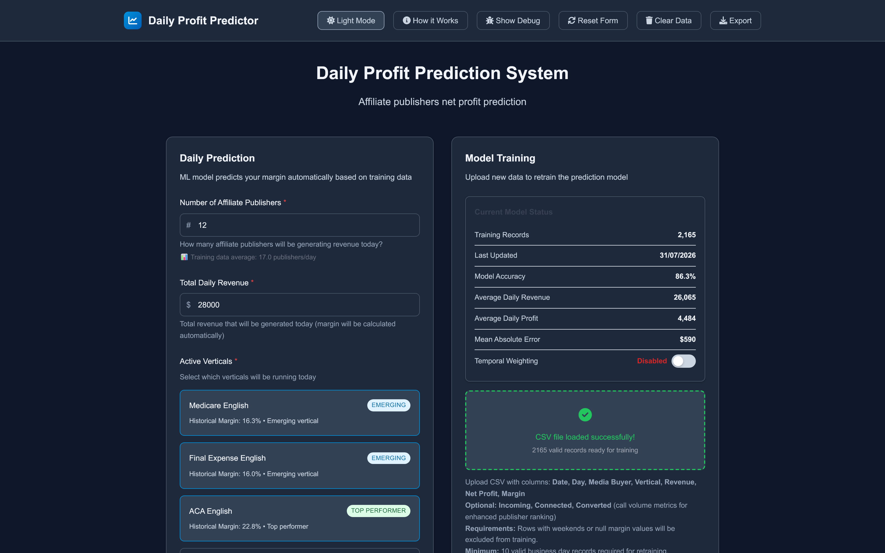

<div align="center">

# Affiliate Profit Predictor

**Know today's net profit before the day is over.**

A self-contained forecasting tool for affiliate networks. Feed it a CSV of historical
publisher performance and it learns your margin structure, then predicts daily net profit
from three inputs: how many publishers are live, expected revenue, and which verticals are running.

No server. No install. Your data never leaves the browser.

### [→ Try the live demo](https://prediction-model-pubs.netlify.app/)

<sub>Load `Data/sample_publisher_data.csv` from this repo to see it predict on real-shaped data.</sub>



</div>

---

## The problem

Affiliate networks find out whether a day was profitable *after* it is over. Revenue is visible
in real time, but margin is not — it moves with the vertical mix, with how many publishers are
live, and with the day of the week. By the time the numbers settle, the decisions that mattered
have already been made.

This tool closes that gap. Point it at your own history and it answers, before the day ends:

- **What net profit should today produce** at this revenue and publisher count?
- **Which publishers actually earn their payout** — ranked, not guessed?
- **Which verticals carry the margin**, and which quietly dilute it?
- **How wrong could this be?** Every prediction ships with a 95% confidence interval.

## See it work

### Prediction with confidence bounds

Not a single number pretending to be certain. Every forecast reports mean absolute error and a
95% interval, plus plain-language insights drawn from your own data.



### Publisher leaderboard

A 0–100 composite score across profit, margin, call performance and consistency — so a
high-margin publisher doing trivial volume does not outrank a workhorse.



### Retrain on your own data

Drop in a CSV and every coefficient is recalculated from scratch: vertical margins, publisher
count effects, day-of-week patterns. Nothing about the model is hardcoded to one network.



<table>
<tr>
<td width="50%" valign="top">

**Retraining report**

Shows exactly which coefficients changed and what the model learned.



</td>
<td width="50%" valign="top">

**Dark mode**

Because these numbers get checked at 6am.



</td>
</tr>
</table>

## Try it in 30 seconds

Open the [live demo](https://prediction-model-pubs.netlify.app/), then:

1. [Download the sample CSV](https://prediction-model-pubs.netlify.app/Data/sample_publisher_data.csv) and drag it onto the upload panel
2. Click **Retrain Model**
3. Set publishers to `12`, revenue to `28000`, tick a few verticals
4. Click **Predict Daily Profit**

Prefer to run it yourself:

```bash
git clone https://github.com/niksaderek/affiliate-profit-predictor.git
cd affiliate-profit-predictor
start index.html          # Windows  (macOS: open index.html)
```

No build step, no dependencies to install, no API keys. It is one HTML file.

> **About the sample data.** `Data/sample_publisher_data.csv` is synthetic — invented publisher
> names over 2,504 rows and 108 business days. Its distributions were fitted to a real book of
> business (margin medians by vertical, daily revenue spread, null-rate, publisher concentration),
> so the model behaves realistically, but no actual client data is published here. Every figure in
> the screenshots above is genuine model output computed from this file.

## How the model works

<details open>
<summary><strong>Prediction pipeline</strong></summary>

Margin is predicted first; profit is derived from it. Working in margin space keeps the model
stable across very different revenue days.

```
CSV → validate → aggregate to business days → learn coefficients → predict margin → × revenue
```

**1. Validation.** Weekend rows dropped, null margins excluded, revenue must be positive.
Retraining requires at least 10 valid business days.

**2. Daily aggregation.** Rows collapse to one record per business day, carrying total revenue,
total profit, distinct publisher count, and the active vertical set.

**3. Learned coefficients.** Each retrain recomputes:

| Factor | What it captures |
|---|---|
| Vertical base margins | The margin each vertical historically returns |
| Publisher count effects | Margin decay as the network widens and control thins |
| Day-of-week patterns | Systematic weekday variation |
| Temporal weighting | *(optional)* Exponential decay, ~2%/day — recent data dominates |

**4. Prediction.** Active verticals contribute a revenue-weighted base margin, adjusted by the
publisher-count coefficient and day-of-week effect, then clamped to a sane 15–45% band.

</details>

<details>
<summary><strong>Publisher scoring (0–100)</strong></summary>

A composite designed so no single dimension can carry a weak publisher:

| Weight | Component | Rationale |
|---|---|---|
| 40% | Daily profit | Absolute contribution — volume matters |
| 25% | Margin rate | Efficiency of that contribution |
| 20% | Call performance | Volume, connect rate, conversion rate |
| 15% | Consistency | Active days; sporadic partners are worth less |

The 40/25 split between profit and margin is deliberate: a 30% margin on $200/day is a worse
partner than 18% on $1,100/day, and a pure-margin ranking gets that backwards.

</details>

<details>
<summary><strong>Accuracy reporting — and its limits</strong></summary>

The reported accuracy is `mean(1 − |predicted − actual| / |actual|)` across daily aggregates,
with relative errors above 300% excluded as outliers. MAE is reported in dollars alongside it,
and drives the 95% confidence interval (`± 1.96 × MAE`).

**Read this honestly:** accuracy is measured on the same aggregates the coefficients were fitted
to. It describes how well the model explains the history it was given — not verified
out-of-sample performance. The MAE and the confidence interval are the numbers to trust for
day-to-day use, and the interval is deliberately wide enough to say so.

</details>

<details>
<summary><strong>Input format</strong></summary>

**Required columns**

| Column | Notes |
|---|---|
| `Date` | `YYYY-MM-DD` |
| `Day` | Day name — drives weekend filtering |
| `Media Buyer` | Publisher name |
| `Vertical` | e.g. `MEDICARE ENGLISH` |
| `Revenue` | Must be positive |
| `Net Profit` | Net of publisher payout and any platform fee — computed upstream, taken as given |
| `Margin` | Decimal, `0.267` = 26.7% |

**Optional** — `Incoming`, `Connected`, `Converted`. Supplying these unlocks the call-performance
component of publisher scoring.

New verticals are picked up automatically from the data; nothing needs to be registered in code.
`Resources/pubs_data_model.sql` is the PostgreSQL extract that produces this schema.

</details>

## Design decisions worth defending

**Predict margin, not profit.** Profit scales with revenue, so a model trained directly on
profit spends its capacity relearning that scaling. Margin is the stationary quantity, and
multiplying back out is trivial.

**Coefficients are never hardcoded.** Every published number — vertical margins, count effects,
day-of-week deltas — is recomputed on retrain. A model that only works on the dataset it shipped
with is a lookup table.

**Ship the error bars.** A point estimate presented alone invites false confidence. MAE and a
95% interval appear next to every prediction, and the accuracy caveat above is stated plainly
rather than buried.

**One file, zero backend.** This handles revenue and margin data. Keeping everything in-browser
means the data never transits a network, which makes it usable on commercially sensitive numbers
without a security review. The cost is a large `index.html`; that trade was made deliberately.

## Stack

Vanilla JavaScript, no framework. [Papa Parse](https://www.papaparse.com/) for CSV parsing,
Font Awesome for icons, CSS Grid/Flexbox for layout. Runs from `file://` — no web server required.

## Repository layout

```
index.html                        Complete application
Data/sample_publisher_data.csv    Synthetic demo dataset
Resources/pubs_data_model.sql     PostgreSQL extract that produces the input schema
docs/images/                      Screenshots
```

## Privacy

All *data* processing is client-side. Your CSV is parsed in browser memory, never uploaded, and
is gone on refresh. There is no backend, no telemetry and no analytics.

The page does fetch three static assets from public CDNs at load (Papa Parse, Font Awesome,
Google Fonts). Those requests carry no data from your file. For a fully air-gapped deployment,
vendor those three locally and drop the CDN `<link>`/`<script>` tags.

---

<div align="center">
<sub>Built by <a href="https://github.com/niksaderek">niksaderek</a></sub>
</div>
